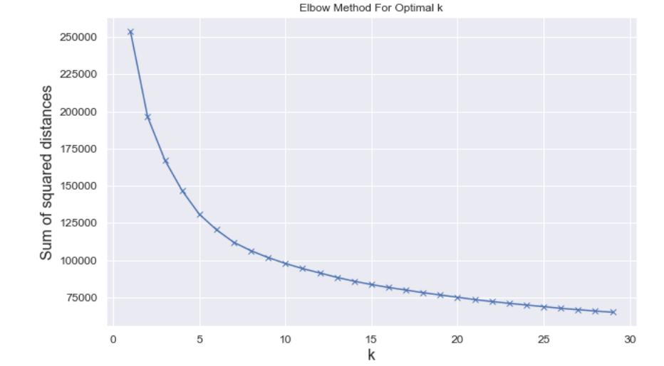
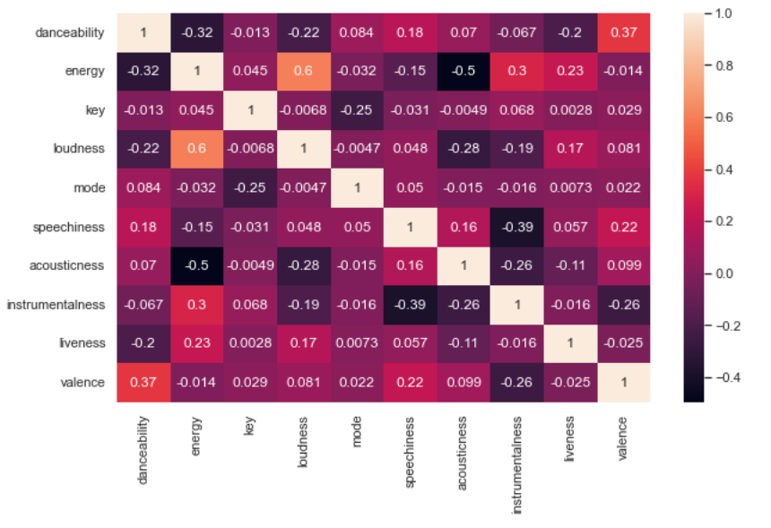
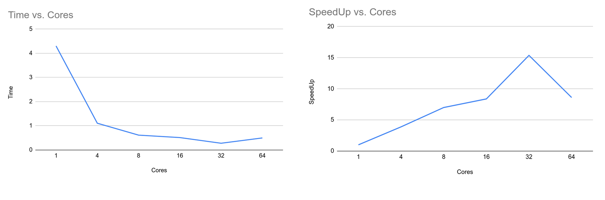
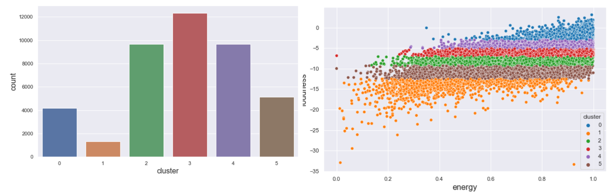
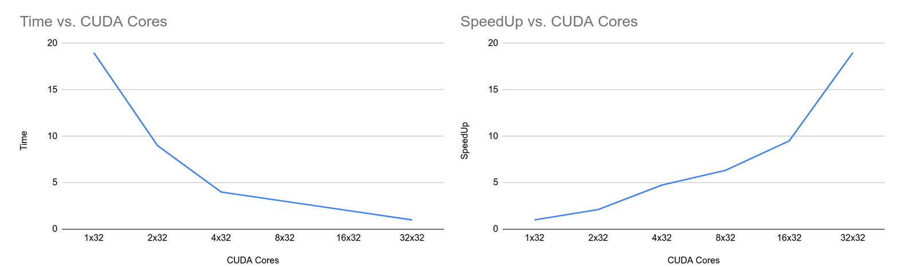
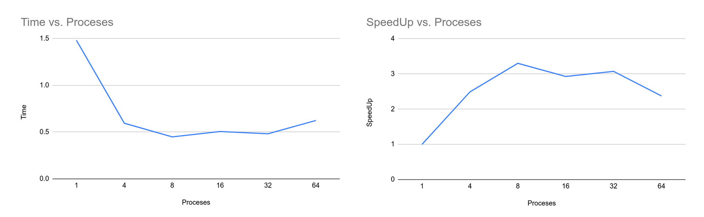

# KMeans Clustering
KMeans clustering is a exploratory data-analysis technique which uses vector quantization to partition data into sub-groups. KMeans clustering groups data into groups which are called clusters. The data inside the cluster are similar to each other and the data between the clusters are different and are far from each other. Each cluster has a centroid. A datapoint belongs to a cluster if the distance between it and the centroid is minimum when compared to other clusters. 
This approach groups similar data to each other and differentiates the data between the clusters. 
The algorithm starts with the random data points assigned to clusters as initial centroids. Then for each datapoint the algorithm determines the nearest cluster according to centroids. After all the data points are assigned to clusters then a new centroid is calculated by computing the average of all the data points in a cluster. The algorithm then repeats until a certain number of iterations or until the centroid doesn’t change on further iteration. 

## Preparation of Dataset
We used a dataset of songs in spotify found from kaggle.
The dataset contains 42305 rows and 22 different columns. In order to decide the columns to be used for the clustering and the number of clusters to be determined we created an elbow diagram (Fig 1) with sum of squared distances for different numbers of  clusters as shown in Fig 1. From fig we can see that the elbow lies in between 6 and 7. 
Based on that the number of clusters was decided to be 6. Similarly, there were 22 different columns which include 10 numerical columns. To decide the columns to be used in clustering we created a correlation heatmap. From the correlation heatmap, 'danceability', 'energy', 'loudness', 'speechiness', 'liveness', and 'valence' was decided to be used for the clustering purpose.
> The dataset is obtained from <a href="https://www.kaggle.com/mrmorj/dataset-of-songs-in-spotify">kaggle</a>.  It's also stored in data dir.

### Correlation heatmap and Elbow Diagram



## Project Structure
The repository  includes the following directories.

- “data”     -> Contains a dataset used for clustering.
- “lib” ->
    - csvReader.h: Code used to read dataset in data folder.
    - kmeans.c, kmeans.h: Serial implementation of KMeans clustering.
- “mpi” -> MPI implementation of KMeans clustering and driver code   “main_mpi.c”. It also re-uses some codes from serial implementation in lib.
- “openmp” ->
Openmp implementation of KMeans clustering and driver code   “main_omp.c”. It also re-uses some codes from serial implementation in lib.
- “main.c” -> Serial driver code of KMeans clustering.

## Serial Implementation
#### Build Instructions:
```bash
$ gcc main.c lib/csvReader.h lib/kmeans.c -o main -lm -std=c11
$ ./main
```

The serial implementation of KMeans clustering algorithm is done in lib/kmeans.c. The file consists of KMeans algorithm and helper functions used by the fit function. The fit function takes the “struct KMeans'' model and runs a clustering algorithm on that model. The algorithm runs for 300 iterations. Before running a fit function the driver code initializes the model with random data points as centroids. For each iteration, the algorithm loops over all the data rows, assigns rows to clusters based on the nearest euclidean distance and re-compute the centroids by determining the average of all the data points inside the cluster. The centroid update algorithm is done using the “update_centroids'' method. The algorithm runs for 300 iterations. The driver code displays the results of the cluster counts for each cluster after the completion of fit method.

***The program took 4.0000 seconds to execute on the “kingspeak” cluster.***


## OpenMP Implementation
#### Build Instructions:
```bash
$ cd openmp
$ gcc -Wall main_omp.c kmeans_omp.c ../lib/kmeans.c -fopenmp -lm -o main_omp
$ ./main <no_threads>    
```

The OpenMP Implementation of KMeans algorithm is straightforward. The serial implementation iterates through each data point and assigns clusters to them. After assigning clusters to each data point it then recomputes the centroid for each cluster by computing an average. We can parallelize this algorithm by parallelizing the for loop used to iterate each data point and assign the cluster. Also we can parallelize the operation of updating centroids after each iteration. Since a centroid update is a calculation to compute mean data points in a centroid we can parallelize this operation too. From the following graphs, we can see that the time taken to complete the algorithm decreases as we increase the number of processor cores. Similarly, the speedup increases as we increase the number of cores. However, at 64 cores, the time is increased and speed up is decreased when compared to 32 cores. The test was run on a kingspeak clusters and as the number of cores reaches to the maximum numbers that system can provide and when there are other processes running as well, the operating system context switches between
the threads, thus decreasing the total time when the number of threads is 64. Similarly, the results obtained from this implementation are consistent with other implementations.



### Clustering Results



## CUDA Implementation
The repository for CUDA Implementation of KMeans can be found here.
#### Build Instructions:
```bash
$ nvcc main.cu ./lib/kmeans.cu -o main 
$ ./main
```
The CUDA Implementation of KMeans algorithm parallelizes the fit function and centroid update method. The iteration of data rows to assign data points to clusters based on the euclidean distance can be parallelized among multiple CUDA cores. Each core can work on a partition of data and assign them to respective clusters. After computation of data classification, all the threads in the block call the update_centroid method, to compute the average of the data points. Update centroid method uses the shared memory to store TPB (Threads Per Block) number of data items in a shared memory. This is used later to compute the average and reduce the global memory access time. After respective data points have been loaded, the first thread of each block uses the ReductionSum operation to sum up the total centroids and number of data items in the cluster. After each iteration, the variables in device code are then copied back to the host using cudaMemCpy and a new centroid is calculated and updated. 

Here are the timing performances and speedup of the KMeans algorithm done on notchpeak cluster. We can see that, as the number of CUDA cores increases, the time taken to complete a k-means algorithm decreases. Similarly, the speedup increases as the number of CUDA cores increases. The results of the clustering are also consistent with other implementation methods.



## MPI Implementation
#### Build Instructions:
```bash
$ cd mpi
$ mpicc -Wall main_mpi.c kmeans_mpi.c ../lib/kmeans.c -lm -o main_mpi -std=c11
$ mpiexec -n <no_processes> ./main_mpi
```

The MPI Implementation of KMeans clustering problem makes use of multiple processes to compute the centroids and the number of data points in the cluster. The root process, rank = 0, is responsible for loading the data from a dataset and scattering the data among other mpi processes. SInce the data may not be divisible by the number of processes, scatterv is used to send the data among the processes. Before scattering the data, some meta information is broadcasted from the root process to other processes so they will be able to receive the data. After the data is scattered, each process computes a new centroid and a reduction operation is done on a global centroid. After all the centroids have been collected from other processes, computed the average between the processes and broadcasted a new centroid to all processes. This operation is repeated for 300 iterations and then results are displayed.


Similar to other implementation approaches, the time taken to complete the algorithm decreases as we increase the number of processes. But as the number of processes is increased the total time to compute the clusters decreases as the work is divided among the processes. The reason behind this is, the total time also includes the time taken to scatter the data among the processes. And as the processes increase the overhead time of communication between the processes also increases thus decreasing speedup of the program. The results obtained from the implementation are also consistent with other implementations.

### Results
Looking at the results obtained from each implementation we can conclude that, MPI implementation of KMeans Clustering is by far the efficient and fast approach to implement the Clustering Algorithm. On fewer cores, CUDA implementation is the worst performing implementation. The reason behind this is the access of global memory for the data point on fewer cores and overhead of the “Memcpy” function on the execution of the program.
